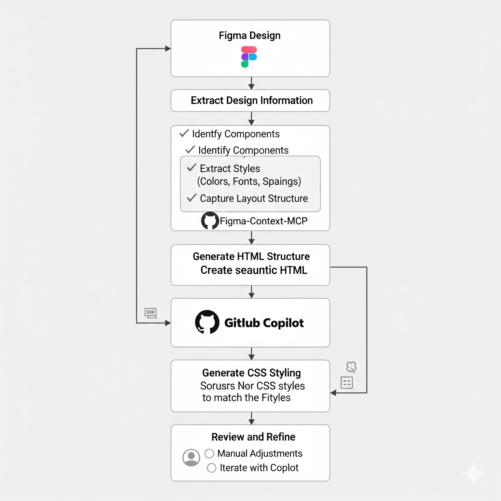
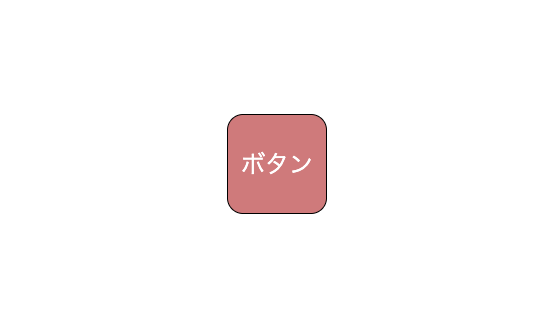

# FigmaデザインをMCP経由で取得し、html/cssを作成してくれるサンプル

このリポジトリは、指定されたFigmaデザインをHTMLとCSSのみで再現したサンプルです。  
FigmaのMCP (Figma-Context-MCP) を使い、デザインを読み取りHTML/CSSを作成しています。  

イメージ図


---

## 事前準備

1. **Node.jsの導入**  
    推奨バージョン: v18以上

2. **Figmaアカウント作成**  
    無料版でOK。Googleアカウントでも作成可能

3. **Figmaで個人トークン生成**  
    - アカウント設定 → 個人アクセストークン  
    - 「File content: Read-only」でOK  
    - トークンは一度しかコピーできないので注意

4. **Figmaでデザイン作成**  
    サンプルは、適当なフレームにボタンを1つ配置

5. **フレームのURLをコピー**  
    - フレーム上で右クリック → コピー/貼り付けオプション → 選択範囲へのURLコピー

6. **ローカルでMCPサーバーを立ち上げ**  
    ターミナルで以下コマンドを実行:
    ```bash
    npx figma-developer-mcp --figma-api-key=【コピーしたFigmaトークン】
    ```
    `http://localhost:3333` に接続できれば成功

7. **GitHub Copilot導入**  
    無料版でOK。VSCode等のIDEに導入

8. **新規プロジェクト作成 & MCP接続情報設定**  
    `./vscode/mcp.json` ファイルを新規作成し、以下を記述:
    ```json
    {
      "servers": {
         "Figma Dev Mode MCP": {
            "type": "sse",
            "url": "http://localhost:3333/sse"
         }
      }
    }
    ```

9. **Copilotにプロンプトを記述**  
    ```text
    Figmaのデザインに合わせてindex.htmlとcssを実装してください。  
    今回は見た目が同じものを作れれば良いです。jsなどの実装は不要です。
    ```
    URL等を求められたら、取得した「フレームのURL」を貼り付け  
    → 自動mcpに接続してfigmaから情報を得て、 `index.html` / `style.css` を作成

---

## ファイルについて

- このフォルダを任意のWebサーバー、またはローカルでブラウザで開いてください。
- ボタンが画面中央に表示され、ホバー時に押下風の効果が出ます。



---

## 参考URL

- [Figma-Context-MCP（Framelink Figma MCPサーバー）徹底解説と使い方](https://qiita.com/syukan3/items/497a8a1aa93b4e2bafe8)  
  ※上記はCursorですが、VSCode + GitHub Copilotでも利用可能です

